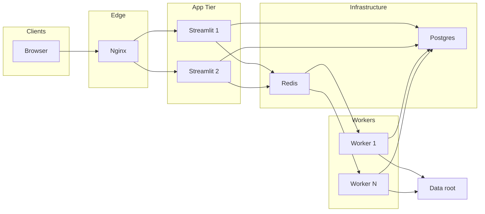

# Evaluation Dashboard

> 📘 **Documentation site**: a detailed, illustrated guide covering every page lives at [docs/guide/index.html](docs/guide/index.html). On a running dashboard it is also served at `<app URL>/app/static/guide/index.html` (linked from the Help page).

## Required Installation

This dashboard and evaluation tool require the following prerequisites and Python packages.

### Python packages (local development / full functionality)
The easiest way is to install from the single `requirements.txt` at the repository root, including private dependencies.

```sh
cd evaluation_dashboard_app
pip install -r requirements.txt
```

Example if you want to install packages manually in separate steps:

```sh
# Basic
pip install \
  streamlit pandas plotly duckdb numpy \
  requests pyyaml matplotlib shapely

# Download / Scenario API authentication
pip install git+ssh://git@github.com/tier4/webauto-auth-py.git

# Production task queue (when USE_TASK_QUEUE=true)
pip install rq psycopg2-binary
```

In the **Docker image**, public dependencies are installed from [`requirements-docker.txt`](requirements-docker.txt), and private packages such as `webauto-auth` and the evaluation dependencies are added during build time using SSH secrets (see [`Dockerfile`](Dockerfile)).

PDF export uses Plotly/Kaleido static image rendering, so **Chrome is also installed in the Docker image**. If you see `Kaleido requires Google Chrome to be installed` in the deployment environment, **rebuild and redeploy** with the latest image.

```sh
# Install CLI tool (if you use it for generating evaluation command lines)
pipx install git+ssh://git@github.com/tier4/v_and_v_util.git
```

### pilot-auto / perception_eval (only needed when generating Summary / Score)
- A pilot-auto environment with `perception_eval` available is required. See "Usage" below.
- If importing `perception_eval` fails, generation of `Summary.csv` / `Score.csv` stops.

### Configuration file
- Input values are saved in `configs/autoware_evaluator_dl_config.json` (created / updated automatically).

## Overview
This is an evaluation dashboard built with Streamlit. It reads evaluation results under `data/` (`Summary.csv`, `Score.csv`, `.parquet`) and visualizes them across multiple pages. In addition, `pages/6_Download.py` supports bulk collection of evaluation results such as `result.txt`, automatic generation of `Summary.csv` / `Score.csv`, and searching / downloading result directories. The **TLR (Traffic Light Recognition) Analysis** page can visualize criteria matrices, vehicle state vs. signal type, important zones, and more for traffic-light recognition evaluation. To use it, you must first download scenario data from **tab 2 "Download Scenarios"** on the Download page.

## Usage

1. To generate summary or score files from `pages/6_Download.py` ("Generate Summary.csv / Score.csv"), you must **activate the pilot-auto (ROS 2) environment in advance** with the following command:
   ```
   source path_to_pilot/install/setup.sh
   ```
   This step is required for "Summary / Score CSV generation" in `pages/6_Download.py`.

2. Start Streamlit from `evaluation_dashboard_app/`.
   ```
   streamlit run Overview.py
   ```

3. Choose pages and filters from the sidebar to explore the data.

### Visualization quick start (recommended workflow)

The recommended flow from downloading logs for a test to generating summaries and then reviewing the details in Overview is the following three-step process:

1. **Download the target test logs from the Download page**
2. **Generate summary / score files from "Eval Results" on the Download page**
3. **Select that log (Run) on the Overview page and inspect the details**

Below is a summary of what to do and what to watch out for in each step.

#### Step 1: Download logs from the Download page

- **Page**: Open **Download** (`6_Download.py`) from the sidebar.
- **Tab**: Select **"Download Results"**.
- **Inputs**:
  - Enter **Project ID** and **Job ID**. Optionally specify a Suite ID if needed.
  - For **Output Path**, specify **a folder dedicated to this test**.
    To make it show up as a selectable "Run" in Overview, it is recommended to place one folder per test directly under `data/`.
    Example: `./data/my_test_20250203`
- **Download Type**:
  - **Archives (ZIP)**: Downloads ZIP archives, extracts them, and takes data for the selected phase. Suitable for full local analysis.
  - **Result JSON only**: Downloads only the result JSON. Lightweight and useful when you only want summary / score generation.
- **Run**: Click "Download Results" and wait for completion.
- **Result**: Under the specified Output Path, logs and, when needed, source files such as `result.txt` and `score.json` are stored in a directory structure based on the job / suite.


#### Step 2: Generate summary analysis results in Eval Results

- **Page**: Stay on the same **Download** page.
- **Tab**: Switch to **"Eval Results (per directory)"** or **"Eval Results"**.
- **Root directory to evaluate**:
  - Specify **the same path used as Output Path in Step 1**.
    Example: `./data/my_test_20250203`
- **Options**:
  - **Search subdirectories**: Searches subdirectories for `result.txt` / `score.json`. Usually this should be enabled.
  - **Only generate Summary.csv and Score.csv**:
    If each directory already contains `result.txt` or `score.json`, enabling this skips re-running `perception_eval` and generates **only `Summary.csv` and `Score.csv`** from the existing results.
    On the first run, if `result.txt` and related outputs do not exist yet, leave this unchecked and run the full evaluation with "Run eval_result for all directories".
- **Run**:
  - Click either "Run eval_result for all directories" or "Generate Summary and Score CSV only".
- **Result**: **`Summary.csv` and `Score.csv`** are generated directly under the specified root directory.
  These files are the "summary analysis results" used by Overview and pages such as TP Summary and Criteria Based Score.


If `perception_eval` is used during Summary / Score generation, you must run `source path_to_pilot/install/setup.sh` in advance as described in "Usage".

#### Step 3: Select the log in Overview and inspect the details

- **Page**: Open **Overview** (`Overview.py`) from the sidebar.
- **Selecting a Run**:
  - Overview treats **each direct subdirectory under `data/`** as one "Run".
  - If the Output Path in Step 1 was `./data/<test_name>`, that `<test_name>` appears in the sidebar dropdown for **"Baseline (A)"**.
  - Choose the log (Run) you want to inspect in **Baseline (A)**.
    If you want to compare runs, switch to **Compare Mode** and choose another Run in **Candidate (B)**.
- **Displayed contents**:
  - Overall metrics based on the selected Run's **Summary.csv** are shown, such as TP mean and XRMS / YRMS / XSTD / YSTD.
  - By filtering with Perception Label / Product Label, you can inspect label-specific TP and metric breakdowns.
  - Other pages such as TP Summary, Criteria Based Score, Detection Stats, and Bounding Box Viewer share the Run selected in Overview through `st.session_state`, so it is best to **select the Run in Overview first** and then move to the detailed pages.


**Key point**:
- Whenever you add a new test, use `./data/<new_test_name>` as the Output Path in Download, then use that same path in Eval Results to generate Summary / Score. The new test will appear in the Overview Run list, and you can inspect it immediately.

## Main Features
- Select a Run on the Overview page, switch between single-run and compare mode, and display overall metrics
- When the production task queue is enabled, track heavy jobs from the UI such as "Recent tasks"
- TP / position / velocity statistical viewers (scatter plots and distributions)
- Criteria-based evaluation viewer (metric distributions, averages, and box plots)
- Detection statistics comparison viewer (for example TP / FP distance-bin comparison)
- BEV bounding-box visualization
- TLR (Traffic Light Recognition) evaluation analysis: criteria matrices, vehicle state vs. signal type, important zones. Requires scenario data downloaded from tab 2 of the Download page.
- Evaluation command generation tool
- **Docker production**: Navigate from Overview to **Deployment debug** (Postgres / Redis / RQ and optional Docker operations)

## Directory Structure
```text
evaluation_dashboard_app/
  Overview.py
  pages/
    1_TP_Summary.py … 10_Help.py, 99_Deployment_Debug.py (sidebar order follows the page numbers)
  lib/
  worker/            # Production: RQ tasks and worker entrypoint
  configs/
    autoware_evaluator_dl_config.json
  deploy/            # Production: compose, nginx, numbered shell steps
    docker-compose.yml
    .env.example
    01_SETUP_ENV.sh ... 10_RESTART_STREAMLIT.sh
    configs/
      autoware_evaluator_dl_config.json   # Mounted inside the container at /app/docker_config during compose runs
    nginx/
  data/
    <run_id>/
      Summary.csv
      Score.csv
    *.parquet
```

## Page Guide

The sidebar order follows the numbering of **`number_name.py` files directly under `pages/`**. **Deployment debug** (`99_Deployment_Debug.py`) must stay directly under `pages/` because it is registered through `st.page_link`. Outside Docker, `inject_app_page_styles` hides that sidebar item with CSS. Inside Docker, there is an explicit link from **Overview**.

Many visualization pages rely on `st.session_state`, so it is best to **select the mode (single / compare) and Run in Overview first**. In compare mode, Baseline (A) and Candidate (B...) are shared across pages.

### `Overview.py` (entry point)
- Starting point for **shared filters** such as single / compare mode, Run selection, and Perception / Product labels.
- **Shareable URL**: The same view can be reproduced using query parameters like `mode`, `run_a`, `run_b`, and so on. Some other pages follow the same pattern.
- When running in Docker, the sidebar shows a link to **Deployment debug** (`pages/99_Deployment_Debug.py`).

### `pages/1_TP_Summary.py`
- **Prerequisite**: Data must already be loaded in Overview. **`Summary.csv` is required**. If a Run does not have it, TP Summary is unavailable, while Detection Stats / BB Viewer can still work with only parquet files and show guidance accordingly.
- In compare mode, **deltas between runs** can be reflected in plots.
- `TP` range, velocity outlier clipping, scatter plots (`xrms`-`yrms`, `vx`-`vy`), and distribution histograms.

### `pages/2_Criteria_Based_Score.py`
- A criteria evaluation viewer based on **`Score.csv`**. Follows the mode selected in Overview.
- Criteria block switching, metric distributions, group averages, box plots, and scenario-level comparisons.
- Includes UI for **Absolute gates** (sign-off by threshold pass / fail) and gate comparison across multiple Runs.

### `pages/3_Detection_Stats.py`
- Aggregates detection evaluation data using **`.parquet` + DuckDB**. Supports filters, hierarchical views, scenario breakdown, and **comparison across multiple Runs** when Overview is in compare mode.
- Distance-bin comparison by status such as TP / FP and color schemes for perception diffs (improved / worsened).

### `pages/4_Bounding_Box_Viewer.py`
- **Prerequisite**: A Run must already be selected in Overview.
- Displays bounding boxes on a **BEV** from `.parquet`. Supports filtering by t4dataset, topic, label, visibility, and more. In compare mode, it can handle multiple Runs.

### `pages/5_Tools.py`
- Evaluation command generation tool
- Extract Job ID / Suite ID from Report / Suite URLs

### `pages/6_Download.py`
- Main integration point with the evaluator. The **tabs** are organized as follows:

  | Tab | Contents |
  |------|------|
  | **Download Results** | Retrieve job results such as archive ZIPs or Result JSON. Output Path is restricted under the data root. |
  | **Download Scenarios** | Download scenario data. Required by **TLR Analysis**. |
  | **View Downloads** | Review downloaded jobs and scenarios. |
  | **Eval Results** | Run evaluation or generate **Summary.csv / Score.csv** from `result.txt` / `score.json` under a root directory. |

- When **`USE_TASK_QUEUE=true`** (Redis + Worker + Postgres), heavy work is queued to workers, and you can track status from the UI through **Recent tasks** and related sections.

### `pages/7_Data_Management.py`
- Displays the list of Runs under the data root, including size, update time, and whether Summary / Score / Parquet files exist.
- Download outputs as a **ZIP**, copy **share links** for Overview, and **delete** Runs to manage storage in a multi-user server environment.

### `pages/8_Parquet_Debug.py`
- For development and troubleshooting. Reads **`.parquet` / `.pkl` / `result.json`** from file paths and shows schemas, keys, criteria state, and optional quick plots.
- Useful for debugging pipeline outputs inside the dashboard.

### `pages/9_TLR_Analysis.py`
- **TLR (Traffic Light Recognition)** evaluation: criteria matrices, vehicle state vs. signal type, important zones, and more. Supports single / compare mode and **shareable URLs** such as `mode`, `path_a`, `path_b`.
- **Prerequisite**: Download scenario data from **Download Scenarios** on the **Download** page and select the TLR result directory as a Run.

### `pages/10_Help.py`
- Displays the repository **README inside the app** so setup instructions, workflows, and documentation can be read directly in the browser.
- Since **Mermaid diagrams** in Markdown are not rendered by default in Streamlit, this page renders them with JavaScript (Mermaid.js).

### `pages/99_Deployment_Debug.py` (Docker only)
- Available only when Streamlit is running **inside a container**. With local `streamlit run`, it stops at a guidance message.
- Because it must be registered as **`pages/*.py` directly under the folder** for `st.page_link`, the corresponding auto-navigation item is **hidden with CSS outside Docker**. In Docker, you can also open it from the **Overview** sidebar via "Deployment debug".
- Lets you inspect the state of Postgres / Redis / RQ, task counts, and, depending on configuration, the host Docker container list, recent logs, and restricted `docker exec`.
- In production, mounting the **Docker socket grants strong privileges**, so check the authentication, VPN, and `EVAL_DEPLOYMENT_DEBUG_*` settings in [docs/PRODUCTION_DEPLOYMENT.md](docs/PRODUCTION_DEPLOYMENT.md).

## Data Formats (high level)
- `Summary.csv`: `id`, `TP`, `xstd`, `xrms`, `ystd`, `yrms`, `vx`, `vy`, `perception_label`, `product_label`
- `Score.csv`: Criteria evaluation metric blocks (`Scenario`, `Option`, `GT_OBJ`, then `criteria0..n`)
- `.parquet`: Fields used for detection statistics / bounding-box viewing, such as `x`, `y`, `length`, `width`, `yaw`, `label`, `source`, `status`

# Docker Usage Guide

The image is **ROS-based**, so the container environment matches the host ROS environment.

### Build Steps

Because private repositories (`tier4/webauto-auth-py`, `tier4/v_and_v_util`) are used, you must provide a **GitHub SSH key** during build time.
Use `~/.ssh/id_rsa` directly. No ssh-agent is required.

```sh
cd evaluation_dashboard_app

# Recommended: add --no-cache if you want to rebuild with the latest dependencies every time.
# If ROS is Humble (can be omitted)
docker build --no-cache --secret id=ssh,src=$HOME/.ssh/id_rsa -t evaluation-dashboard .

# If you want to switch ROS_DISTRO to Iron / Jazzy etc.
docker build --build-arg ROS_DISTRO=iron --secret id=ssh,src=$HOME/.ssh/id_rsa -t evaluation-dashboard .
```

### Production deployment

For multi-user / production use, the recommended setup is **Nginx -> Streamlit -> Redis (task queue) -> Worker -> Postgres**. Heavy jobs such as downloads, evaluation, Summary / Score CSV generation, and parquet generation are executed by workers instead of the UI process, and task state is stored in Postgres.

**Target Architecture:**



- **Build**: As described above in "Build Steps", run `docker build ... -t evaluation-dashboard .` in `evaluation_dashboard_app/`. The compose services `streamlit1` (default), optional `streamlit2` (`--profile ha`), and `worker` all use this image.
- **Recommended flow (`deploy/` numbered scripts)**: Move into `deploy/` and run the scripts in order. All of them use `docker compose --env-file .env`.

  | Script | Description |
  |-----------|------|
  | `01_SETUP_ENV.sh` | Create `.env` from `.env.example` if it does not exist. **You still edit it manually.** |
  | `02_BUILD.sh` | Build the image. You can pass arguments such as `--no-cache`. |
  | `03_INIT_DB.sh` | **First time only**: after Postgres starts, run `init_db` to create task tables. |
  | `04_START.sh` | Start the stack. Default worker count comes from `.env` `EVAL_COMPOSE_SCALE_WORKER`; for example `./04_START.sh --scale worker=3` overrides it. |
  | `05_STOP.sh` | Stop the stack. |
  | `06_STATUS.sh` | Check service status. |
  | `07_LOGS.sh` | Run `docker compose logs -f`. Without arguments it shows all services; for example `./07_LOGS.sh worker`. |
  | `08_REBUILD_AND_START.sh` | Build and then start the stack, same startup behavior as `04_START.sh`. |
  | `09_RESTART_WORKER.sh` | Restart workers so code changes are reflected on the worker side. |
  | `10_RESTART_STREAMLIT.sh` | Restart only running Streamlit services, leaving workers and queued tasks alone. |

- **Manual setup is also possible**: `cd deploy && cp .env.example .env` -> edit `.env` -> `docker compose --env-file .env up -d`. For first-time setup only, run `docker compose --env-file .env run --rm init_db` (equivalent to `03_INIT_DB.sh`).
- **Access**: In production compose, **Nginx listens on port 80**, and Streamlit is accessed through the proxy (see `docker-compose.yml` / `nginx/nginx.conf`). Since the source code and `lib/` are mounted, **Streamlit reloads easily when files change**, but **workers must be restarted after Python code changes**.
- **If the UI keeps loading forever**: Streamlit communicates with the browser over **WebSocket**. Suggested checks: (1) do a **hard reload** including cache reset or reopen in another tab, (2) by default Nginx points only to **one Streamlit app** (`streamlit1`), and a second instance should be enabled only when needed with `docker compose --profile ha up -d` plus upstream changes in `nginx.conf`, (3) set **`STREAMLIT_SERVER_COOKIE_SECRET`** in `deploy/.env.example`, (4) use `.streamlit/config.toml` `enableWebsocketCompression = false` and Nginx `proxy_buffering off` plus suitable `proxy_*_timeout`, and (5) check logs with `docker compose logs streamlit1 nginx`.
- **502 Bad Gateway**: This happens when Nginx **cannot reach Streamlit** because the process exited, was killed by OOM, or stayed blocked for too long. Check `docker compose logs streamlit1` and host **`dmesg`** for OOM messages. Heavy pages can consume significant memory, so the **default single-instance setup** and the single upstream in `deploy/nginx/nginx.conf` are recommended.
- **Troubleshooting Detection Stats freezes / 502**: Set **`EVAL_DETECTION_STATS_DEBUG=1`** in `.env` so it is passed into the compose `streamlit1` service, then restart. The **Detection Stats debug** expander at the bottom of the page and the stderr of **`docker compose logs streamlit1`** will show section boundaries, `getrusage` memory values, and elapsed time before / after DuckDB calls.
- **If a subpage says "load in Overview" even though Overview was already opened**: Session state is stored **in memory per replica**. Overview also syncs `mode` / `run_a` / `run_b`... into the URL, so when those query parameters remain in the address bar, subpages such as Detection Stats can **rebuild `run_a` into `runA`** via `lib/overview_url_hydrate.py`. Open **Overview once**, confirm the address bar contains `run_a=`, then move to the subpage, or reopen from the **Overview share link**.
- **Avoid duplicate config management**: During compose runs, `deploy/configs/autoware_evaluator_dl_config.json` is mounted inside the container as `EVAL_DASHBOARD_CONFIG` (`/app/docker_config/...`). This is a separate file from the host `configs/` version, so edit the one under `deploy/configs/` for Docker-specific settings.
- For detailed settings and environment variables, see [docs/PRODUCTION_DEPLOYMENT.md](docs/PRODUCTION_DEPLOYMENT.md).

### Startup and data mount (single container)

Always mount the `data/` directory so data is persisted and visible.

```sh
docker run -p 8501:8501 \
  -v "$(pwd)/data:/app/data" \
  -v ~/.webauto:/root/.webauto \
  evaluation-dashboard
```

### Example: run in background (`-d`)

If you want to start the container in detached mode, add `-d` and optionally set `--name`. If you want to synchronize the entire `/app` tree, including code and notebooks, with the host, use the following form.

```sh
docker run -d --name evaluation-dashboard \
  -p 8501:8501 \
  -v "$(pwd):/app" \
  -v ~/.webauto:/root/.webauto \
  evaluation-dashboard
```

### Multi-user deployment

If multiple people access the same server for downloads, evaluation, result review, sharing, and data management, refer to the following points.

- **Data root**: You can set the evaluation data root with environment variable `EVAL_DASHBOARD_DATA_ROOT` (default is `data`). Example: `-e EVAL_DASHBOARD_DATA_ROOT=/var/eval_dashboard/data`
- **Path restriction**: The Download Output Path and Eval Root directory are restricted under this data root, and path traversal is rejected.
- **Data Management page**: Lets you view the Run list, show sizes, delete Runs, and copy share links. You can remove unnecessary Runs to manage disk usage.
- **Sharing results**: By adding `?mode=...&run_a=...&run_b=...` to the Overview URL, you can share the same Run view. Links can be copied from Data Management or "Share this view" in Overview.
- See [docs/MULTI_USER_DEPLOYMENT.md](docs/MULTI_USER_DEPLOYMENT.md) for more details.

### Debugging and shell access

If you want shell access inside a running container, use one of the following methods.

**1. Enter bash by container ID**
```sh
docker ps         # check the [CONTAINER ID]
docker exec -it [CONTAINER ID] /bin/bash
```

**2. Start directly with bash as the entrypoint**
```sh
docker run -it --entrypoint bash \
  -v "$(pwd)/data:/app/data" \
  evaluation-dashboard
```
